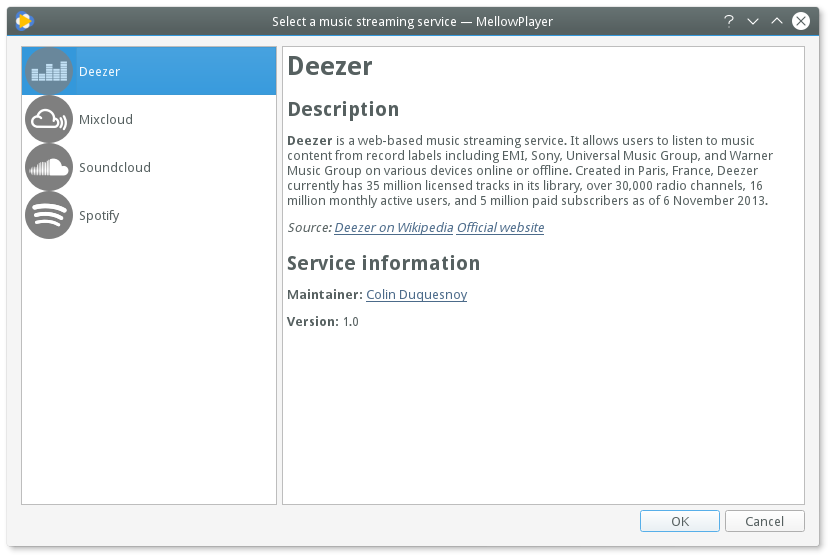
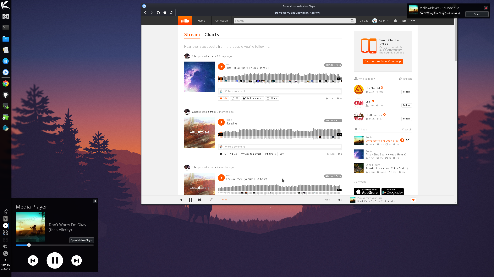
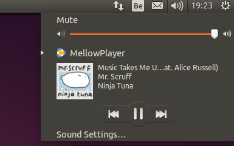

Getting started
===============

First startup
-------------

On the first startup, you'll be presented with the following screen:

.. image:: ../_static/home-page.png
    :align: center

Just click on "Select a music streaming service" button. This will bring the following
dialog:

Make your choice and press OK.

The music streaming service will start loading. Once it has loaded you may log-in or start playing some music!

Notifications
-------------

By default, MellowPlayer will display a notification whenever the current track changed.

.. image:: ../_static/notification-plasma5.png
    :align: center

You can turn this feature off:

**Application > Preferences > Notifications**: uncheck the notifications you're not interested in.

MPRIS2 Interface
----------------

Most GNU/Linux Desktop Environments have a MPRIS client interface that sits
in the system tray and let you control media players easily.

MellowPlayer implements the DBUS MPRIS 2 interface and should appear in your MPRIS2
client interface:

- Plasma 5:

.. image:: ../_static/mpris-player-plasma.png
    :align: center

- Gnome:

.. image:: ../_static/mpris-player-gnome.png
    :align: center

- Unity:

