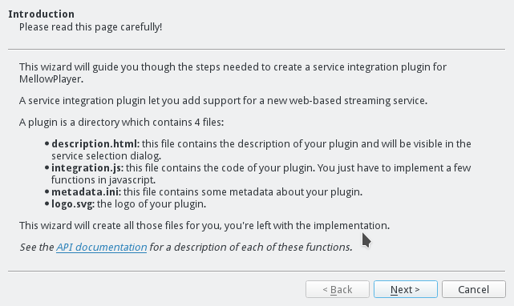
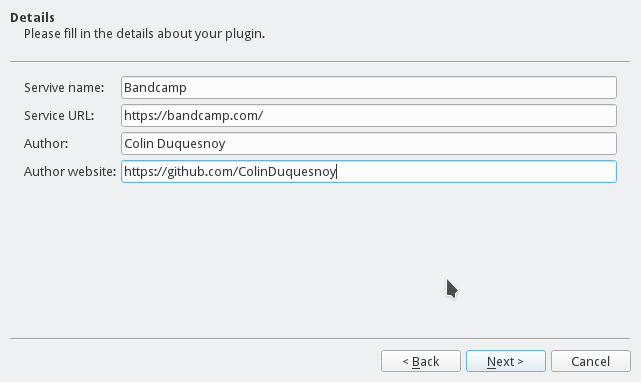
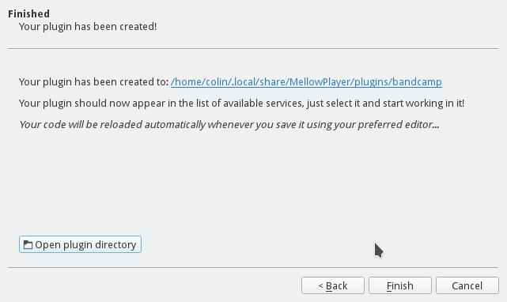

Plugins
=======

Introduction
------------

MellowPlayer can be extended by writing a *streaming service integration plugin*.

*A streaming service integration plugin* is just a directoy that contains some specific files:

- **description.html**: describes the web streaming service. This description
  appear in the service selector dialog.
- **integration.js**: the actual code that integrates the service into MellowPlayer
- **logo.svg**: the logo of the service
- **metadata.ini**: plugin's metadata

The file **integration.js** contains a series of function that you must implement. Those functions will get called
by the C++ application for updating the player state or when the user triggered an action (play, pause,...).

MellowPlayer will look for plugins in the following directories:

- **$CURRENT_WORKING_DIR/plugins**
- **/usr/share/mellowplayer/plugins**
- **/usr/local/share/mellowplayer/plugins**
- **~/.local/share/MellowPlayer/plugins**

Create a new plugin
-------------------

To create a plugin, go to the **Control** drop down menu or the **Developer** main menu and click on **Create plugin**. 

This will bring the following wizard:

Fill in the details:

When you're done, select your new plugin service in the services dialog that will automatically pop out:

Functions to implement
----------------------

Here is a brief description of the functions you need to implement in order to 
integrate a new web-based streaming service.

update()
++++++++++++++++++

This function is called regularly to update the player information.

You must return a dictionnary with the following keys:

- **playbackStatus** *(int, use mellowplayer.PlaybackStatus)*
- **canSeek** *(bool)*
- **canGoNext** *(bool)*
- **canGoPrevious** *(bool)*
- **canAddToFavorites** *(bool)*
- **volume** *(float [0-1])*
- **songId** *(str)*
- **songTitle** *(str)*
- **artistName** *(str)*
- **albumTitle** *(str)*
- **artUrl** *(str)*
- **isFavorite** *(bool)*
- **duration** *(int [seconds])*
- **position** *(int [seconds])*

play()
++++++

Starts playback.

pause()
+++++++

Pauses playback.

goNext()
++++++++

Skips to next song.

goPrevious()
++++++++++++

Skips to previous song.

setVolume(volume)
+++++++++++++++++

Sets the player's volume.
  
**volume** is a *float* in the range [0-1].

addToFavorites()
+++++++++++++++++++

Adds song to favorites.

removeFromFavorites()
+++++++++++++++++++++

Removes song from favorites.

seekToPosition(position)
++++++++++++++++++++++++

Seeks to the specified position. 

**position** is an *int* representing the new position inside the song (in seconds).

PlaybackStatus
--------------

MellowPlayer will inject a few constants that you can use for representing the current PlaybackStatus:

- **mellowplayer.PlaybackStatus.STOPPED**: indicates that the playback has stopped.
- **mellowplayer.PlaybackStatus.PAUSED**: indicates that the playback has paused.
- **mellowplayer.PlaybackStatus.BUFFERING**: indicates that the a song is buffering.
- **mellowplayer.PlaybackStatus.PLAYING**: indicates that the a song is currently playing.
