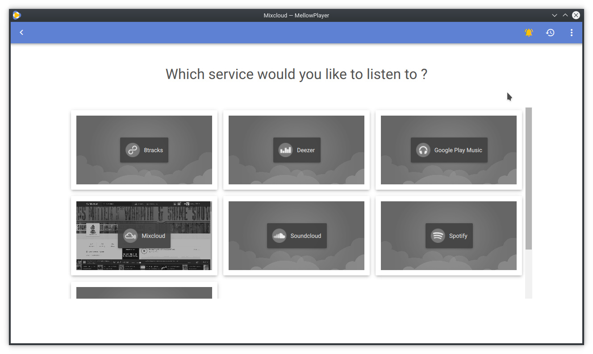

Getting started
===============

First startup
-------------

On the first startup, you'll be presented with the following screen:

Just click on a service to start running it. You can start multiple service at the same time and quickly switch between
them using Ctrl+Tab/Ctrl+Shift+Tab.

You can get back to the service selection page using F8 or the select service button:

Application Settings
--------------------

You can change application settings by clicking on the menu button and by selecting the Settings entry or by pressing F2:

This will bring the following page:

There are a series of settings category:

- General: general options
- Appearance: let you change the appearance of the application
- Notifications: let you change some notification settings
- Shortcuts: let you change all the application shortcuts
- Privacy: enable or disable privacy related options
- Services: list the available services and let you change their default url.
- Cache: a few buttons that let you clear the application cache (album art covers,...) and clear the web cookies.

Notifications
-------------

By default, MellowPlayer will display a notification whenever the current track changed.

You can change the notifications behaviour in the application settings page

and you can also quickly toggle notifications on/off using the button in the toolbar:

.. image:: ../_static/notification-button.png
    :align: center

Listening History
-----------------

MellowPlayer can keep track of your listens and display it in a side panel. This feature is OFF by default.

You can see your listening history by pressing the listening history button:

Here is what the history look like:

You can search the history and filter by service by clicking on the search icon

MPRIS2 Interface
----------------

Most GNU/Linux Desktop Environments have a MPRIS client interface that sits
in the system tray and let you control media players easily.

MellowPlayer implements the DBUS MPRIS 2 interface and should appear in your MPRIS2
client interface:

- Plasma 5:

- Gnome:

- Unity:

.. image:: ../_static/mpris-player-unity.png
    :align: center
